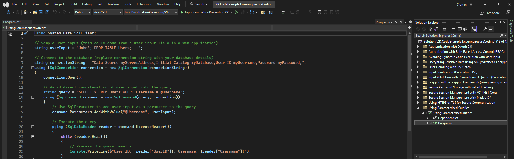

# Best Practices for Maintaining Security and Preventing Vulnerabilities in C#
This repository contains code examples that demonstrate best practices for ensuring secure coding in C#. These examples showcase various techniques to maintain application security and prevent common vulnerabilities. The code examples cover the following topics:

## Input Validation and Sanitization
Ensuring proper input validation and sanitization is crucial in preventing potential security vulnerabilities such as SQL injection and cross-site scripting (XSS) attacks. By implementing these best practices, you can fortify your C# applications against malicious user inputs and enhance overall security.

### Input Validation with Parameterized Queries (Preventing SQL Injection)
SQL injection is a common attack vector where an attacker injects malicious SQL code into an application's input fields, potentially gaining unauthorized access to the underlying database. To mitigate this risk, it is essential to use parameterized queries when interacting with databases.

In the provided code example image below we demonstrate how to utilize parameterized queries to prevent SQL injection. By separating the SQL query from user input and binding the input as parameters, the database engine treats user input as data rather than executable code, effectively thwarting SQL injection attempts.

### Input Sanitization (Preventing XSS)
Cross-site scripting (XSS) is another significant threat that arises when untrusted user input is rendered on a web page without proper sanitization. This can lead to attackers injecting malicious scripts into the page, potentially compromising the users' data or hijacking their sessions.

In the code example code image below, we demonstrate how to perform input sanitization to prevent XSS vulnerabilities. By employing encoding mechanisms such as HTML encoding, we ensure that user input is rendered as plain text and not interpreted as HTML or JavaScript code, thus mitigating the risk of XSS attacks.
 
By combining both input validation with parameterized queries and input sanitization, you can significantly enhance the security of your C# applications, providing robust protection against SQL injection and XSS vulnerabilities.

Note: These examples are simplified for demonstration purposes. In real-world scenarios, you should apply these practices alongside other security measures, tailored to the specific requirements of your application.

## Authentication and Authorization
Authentication and authorization are critical aspects of ensuring secure access to your C# applications. By implementing robust authentication mechanisms and role-based access control (RBAC), you can verify the identity of users and control their access to various resources within your application.
### Authentication with OAuth 2.0
OAuth 2.0 is an industry-standard protocol used for secure authentication in web applications and APIs. It enables users to grant limited access to their resources on one website without sharing their credentials directly. Instead, OAuth 2.0 issues access tokens to authorized applications, allowing them to access specific resources on behalf of the user.

In the provided code example below image, we demonstrate how to implement authentication with OAuth 2.0 in a C# application. This example uses JWT (JSON Web Token) with OAuth 2.0 for secure authentication. The user's identity is verified, and upon successful authentication, a JWT token is generated, containing user-specific claims, which can be used for subsequent authorization.
 
 
### Authorization with Role-Based Access Control (RBAC)
Role-Based Access Control (RBAC) is a widely adopted approach for controlling access to resources based on users' roles within an application. With RBAC, users are assigned specific roles (e.g., admin, user, moderator), and each role is associated with a set of permissions that determine what actions users can perform.

In the code example below image, we demonstrate how to implement authorization with RBAC in a C# application. The code checks if a user has the necessary role (e.g., "admin") to access a specific resource (e.g., "AdminPanel"). If the user has the required role, access is granted; otherwise, access is denied.
 
 
By combining robust authentication with OAuth 2.0 and fine-grained authorization with RBAC, you can enforce secure access controls, ensuring that users can only access the resources they are authorized to use.

Note: While these code examples demonstrate the fundamental concepts of authentication and authorization, implementing secure authentication and authorization often involves additional considerations such as user management, token validation, and session management. In production applications, it is essential to use established authentication and authorization frameworks and adhere to best practices to ensure a high level of security.

## Secure Password Handling
Securing passwords is a critical aspect of maintaining application security. Passwords should never be stored in plain text, as this exposes sensitive user credentials to potential breaches. Instead, passwords should be securely hashed and salted before storage.

### Secure Password Storage with Salted Hashing
Hashing is a one-way cryptographic process that converts a plain text password into a fixed-length string of characters, called a hash. In case of a data breach, hashed passwords are much more challenging for attackers to reverse back to their original form, ensuring better security for user credentials.

However, using just hashing might still be susceptible to dictionary attacks or rainbow table attacks, where attackers use precomputed hash values for common passwords. To mitigate these risks, a technique called "salting" is used.

In the provided code example below image we demonstrate how to securely hash and salt passwords for storage. The code first generates a random salt unique to each user and then combines it with the user's password. This combination is hashed using a strong cryptographic hashing algorithm, such as SHA-256 or bcrypt, producing a salted hash.
 
 
During the authentication process, the salt and hashed password are retrieved from the database for the specified user. The entered password is hashed with the stored salt, and the resulting hash is compared to the stored hash. If they match, the user is granted access, ensuring secure password verification.

By employing salted hashing, you significantly enhance the security of password storage, protecting user credentials from various attack vectors and improving overall application security.

Note: When choosing a hashing algorithm, it is essential to use a well-established, cryptographic hashing function with a strong track record of security. Additionally, consider using a library or framework that provides secure password handling functionalities to ensure robust password security.

## Protecting Sensitive Data
Protecting sensitive data is of paramount importance to prevent unauthorized access and data breaches. To ensure data confidentiality both at rest and during transmission, it is crucial to employ encryption and secure communication protocols.

### Encrypting Sensitive Data using AES (Advanced Encryption Standard)
AES (Advanced Encryption Standard) is a widely used symmetric encryption algorithm known for its security and efficiency. It is suitable for encrypting sensitive data, ensuring that even if the data is compromised, it remains unreadable without the proper decryption key.

In the provided code example below image, we demonstrate how to use AES encryption to protect sensitive data before storing it in a database or on disk. The code illustrates the encryption process, where data is transformed into ciphertext using a secret encryption key. To decrypt the data, the same key is required, providing a secure means to protect sensitive information from unauthorized access.
 

### Using HTTPS/TLS for Secure Communication
HTTPS (Hypertext Transfer Protocol Secure) is a secure communication protocol that encrypts data transmitted between a client (e.g., web browser) and a server, ensuring confidentiality and integrity of the data in transit. It uses TLS (Transport Layer Security) to create a secure and encrypted channel for data exchange.

In the code example image below, we demonstrate how to enable HTTPS/TLS in a C# application to ensure secure communication over the network. This is particularly important when handling sensitive data, login credentials, or other private information during user interactions.
 
By combining encryption with AES for sensitive data storage and using HTTPS/TLS for secure communication over networks, you establish a strong defense against unauthorized access and eavesdropping, ensuring that sensitive data remains protected throughout its lifecycle.

Note: When implementing encryption, it is crucial to manage encryption keys securely and restrict access to them to authorized personnel only. Similarly, HTTPS/TLS certificates must be issued by trusted Certificate Authorities (CAs) to ensure a secure and authenticated connection.

## Avoiding Code Injection
Preventing code injection attacks is a vital aspect of ensuring the security and integrity of C# applications. By adopting robust practices like using parameterized queries and avoiding dynamic code execution with user input, you can safeguard your application from potential code injection vulnerabilities.

### Using Parameterized Queries
Parameterized queries are a powerful defence against SQL injection attacks, one of the most prevalent code injection threats. By using parameterized queries, you ensure that user inputs are treated as data rather than executable code. This prevents attackers from manipulating SQL queries to gain unauthorized access to your database.

In the provided code example image below, we demonstrate how to use parameterized queries in C# to safely interact with a database. The code separates user input from the SQL query and binds input values as parameters, effectively neutralizing SQL injection attempts.
 
 
### Avoiding Dynamic Code Execution with User Input
Another type of code injection is when user input is directly used to construct dynamic code or commands that are executed by the application. This can lead to command injection or other dangerous exploits if malicious input is supplied.

In the code example image below, we show how to avoid dynamic code execution by carefully validating and sanitizing user input. Instead of directly executing code constructed with user input, the code example uses safer alternatives, such as predefined logic or lookup tables, to handle different user scenarios.
 
By employing both parameterized queries and avoiding dynamic code execution with user input, you bolster the security of your C# applications and reduce the risk of code injection attacks. Vigilance in handling user input is crucial to maintaining a robust defense against potential vulnerabilities.

Note: While these code examples demonstrate fundamental concepts of code injection prevention, it's essential to consider other security practices, such as input validation, output encoding, and adhering to the principle of least privilege, to comprehensively safeguard your applications against code injection and other security threats.

## Error Handling and Logging
Proper error handling and logging are essential components of maintaining a secure and reliable C# application. By effectively handling errors and logging relevant information, you can identify issues, debug problems, and respond to potential security incidents promptly.

### Error Handling with Try-Catch
Using try-catch blocks is a fundamental error handling technique in C#. It allows you to gracefully handle exceptions that may occur during the execution of your code. By catching exceptions and handling them appropriately, you prevent application crashes and provide a better user experience.

In the provided code example in the image below, we demonstrate how to use try-catch blocks to handle exceptions in C#. The try block contains the code that might throw an exception, while the catch block catches and handles the specific exception type. This way, even if an error occurs, the application continues running without abrupt termination.
 

### Logging with a Logging Framework (using Serilog as an example)
Logging is crucial for tracking application behaviour, identifying potential issues, and investigating security incidents. Using a logging framework simplifies the process of recording valuable information about the application's execution.

In the code example in the image below, we showcase logging using Serilog, a popular logging framework in the .NET ecosystem. Serilog provides a flexible and configurable way to capture logs and store them in various formats (e.g., text files, databases). This allows developers and administrators to monitor and analyze application behaviour effectively.
 
By combining error handling with try-catch and logging with a powerful framework like Serilog, you can enhance the resilience of your C# application and gain valuable insights into its performance and potential security issues.

Note: When logging sensitive information, exercise caution to avoid exposing sensitive data in log files. Apply proper log-level configurations to control the verbosity of logged information in different environments (e.g., development, testing, production). Regularly monitor and review logs to detect anomalies and respond promptly to security incidents.

## Secure Session Management
Ensuring secure session management is crucial for maintaining the confidentiality and integrity of user sessions within your C# applications. Proper session management protects against session hijacking and unauthorized access, providing a trustworthy user experience.

### Secure Session Management with ASP.NET Core
ASP.NET Core provides built-in features for secure session management. By leveraging ASP.NET Core's session middleware, you can manage user sessions and apply security measures to protect sensitive session data.

In the provided code example in the image below, we demonstrate how to enable and configure secure session management in an ASP.NET Core application. This includes setting session timeout, enabling HTTPS-only cookies, and using cookie encryption to protect session data during transmission.
 
By implementing secure session management with ASP.NET Core, you establish a robust defence against session-related attacks and ensure user sessions remain protected.

### Secure Session Management with Native C#
In scenarios where you are not using a framework like ASP.NET Core, it is still essential to implement secure session management natively in C#. This involves managing session data and applying security practices to safeguard sensitive information.

In the code example in the image below, we demonstrate how to implement secure session management directly in C#. This example covers session data handling and expiration, ensuring that sensitive user data is appropriately managed and invalidated after a specified period.
 
By adopting secure session management practices in native C#, you can maintain control over user sessions and protect sensitive information from unauthorized access.

Note: While ASP.NET Core and native C# both provide secure session management approaches, the choice of implementation depends on your specific application requirements. Be sure to follow security best practices, including proper session timeout settings, session fixation protection, and secure cookie handling, to maximize the security of your session management solution.

## About The Author Ziggy Rafiq 
- **Technical Lead Developer, C# Corner (MVP 🏅, VIP⭐️, Public Speaker🎤), Mentor, and Trainer**
- **C# Corner MVP, VIP, Speaker, Chapter Lead UK**
- Mentor and Trainer with solid experience in System Architecture for over 19 years
- Link to [**Ziggy Rafiq Blog**](https://blog.ziggyrafiq.com)
- Link to [**Ziggy Rafiq Website**](https://ziggyrafiq.com)
* [**Please remember to subscribe to My YouTube channel**](https://www.youtube.com/)
* [**Please remember to follow me on LinkedIn**](https://www.linkedin.com/in/ziggyrafiq/)
* [**Please remember to connect with me on C# Corner**](https://www.c-sharpcorner.com/members/ziggy-rafiq)
* [**Please remember to follow  me on Twitter/X**](https://twitter.com/ziggyrafiq)
* [**Please remember to follow  me on Instagram**](https://www.instagram.com/ziggyrafiq/)
* [**Please remember to follow  me on Facebook**](https://www.facebook.com/ziggyrafiq)

Ziggy Rafiq is the author and creator of this repository. He is a C# Corner MVP Award recipient in 2023, with over 20 years of technical experience using Microsoft technologies and tools. Ziggy has earned various other awards in the past for his contributions to the tech community.

Please note that these examples are simplified for demonstration purposes. In real-world applications, additional security measures and best practices may be required. It is essential to adapt these practices to the specific requirements and security needs of your application.

We hope these code examples serve as a useful reference for maintaining security in your C# applications. Should you have any questions or feedback, please feel free to reach out.

**Happy and Secure Coding!**
